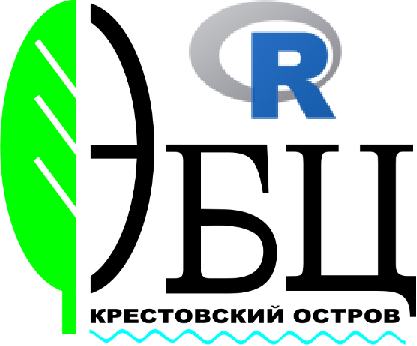

```{r echo=FALSE, include=FALSE}
library(knitr)
opts_chunk$set(echo = FALSE, message = FALSE)
```


```{r, echo=FALSE,out.width="40%",fig.cap = " ", fig.show='hold',fig.align='center'}





```


# О курсе

Целевой аудиторией курса  являются авторы, работа которых связана с созданием документов, презентирующих данные и их производные (иллюстрации и таблицы). 

- Научные статьи
- Научные отчеты
- Квалификационные работы 
- и многое другое...

Все упомянутые выше типы *литературных* произведений основаны на том, что автор на входе имеет *данные*, собранные в результате исследования, а на выходе *отформатированный текст*, в который вставлены рисунки и таблицы, отражающие информацию о данных.  

Процесс подготовки таких документов часто "бесструктурен" - подготовив исходные данные, автор начинает порождать из них рисунки и таблицы, которые обычно хранятся как отдельные сущности (отдельные файлы или отдельные листы или фрагменты листов в Excel). Обычно, параллельно происходит написание текста (как правило это происходит в редакторе типа Word), в который, по мере необходимости, вставляются рисунки и таблицы. Этот стиль опробован многими поколениями и кажется естественным и комфортным. Однако проблемы начинаются тогда, когда выясняется, что в первичных данных была какая-то ошибка или появились новые данные, которые изменят уже подготовленные рисунки и таблицы. Хорошо, если автор пунктуален и внес изменения во все производные от первичных данных документы. Часто ошибки проникают в финальные версии текста.

Избежать упомянутых проблем помогает философия *литературного программирования*. Идея этого подхода заключается в том, что основа основ, первичные данные, становятся фундаментом, частью *проекта*, на котором постепенно выстраивается текст, в который вставляются не сами рисунки (или таблицы), но  *алгоритмы*, порождающие эти *визуализации*. Сам же продукт, производимый в результате реализации проекта, в итоге, является результатом работы некоторой программы, алгоритма, который производит отформатированный документ (файл Word, html-страница, Power Point презентация, или документ в формате pdf). 

Алгоритмы описываются с помощью специализированных языков. В данном курсе мы освоим основы использования двух языков: *R* и *R Markdown*.  

Язык *R* позволит нам создать алгоритм, порождающий из первичных данных изящные рисунки и таблицы.

Язык *R Markdown* позволит описать алгоритм размещения материалов (заголовков, текстовых блоков, рисунков и таблиц) в финальном документе.  

# Минимальные требования для участников

- Базовые навыки рабты с компьютером: умение находить файлы, создавать папки, перамещать и копировать файлы и т.п.
- Базовые навыки работы в MS Office (Word, Excel). 
- Умение просматривать html-файлы через браузер (Firefox, Chrome, Edge, Opera)
- Умение устанавливать программы на компьютер из сети Интернет.
- Умение читать простейшие тексты на английском языке. Достаточно также умения переводить тексты электронным переводчиком. Лучшим электронным переводчиком в настоящее время является [DeepL](https://www.deepl.com/ru/translator).
- Наличие связи с Интернет.


Для успешного прохождения курса, Вы должны понимать, что примерно 20% времени семинара составляют лекции, и **80%– самостоятельные занятия: выполнение домашнего задания + освоение материала**. В конце участники работают со своими данными – индивидуальные проекты, чтобы закрепить полученные знания наилучшим образом. 


Внимание! Курс насыщенный и сложный!  Возможно, Вам поможет прохождение вот [этого бесплатного русскоязычного курса](https://stepik.org/course/129/promo#toc). 

<br>
<br>


<!-- # Контакты -->

<!-- ```{r} -->
<!-- library(cowplot) -->
<!-- library(ggplot2) -->
<!-- library(ggtext) -->
<!-- photo_2 <- ggdraw() + draw_image("Figures/Vadim.jpg") -->

<!-- df <- data.frame( -->
<!--   label = "**Хайтов Вадим Михайлович**  <br> email: polydora@rambler.ru <br> Кандидат биологических наук, педагог дополнительного образования Санкт-Петербргского Городского Дворца Творчества Юных, ведущий научный сотрудник Кандалакского государственного заповедника, преподаватель Санкт-Петербургского Государственного ниверситета,  Научная сфера: морская биология, биостатистика, научное образование школьников." , -->
<!--   x = c(0), -->
<!--   y = c(1), -->
<!--   hjust = c(0), -->
<!--   vjust = c(1), -->
<!--   orientation = c("upright"), -->
<!--   color = c("black"), -->
<!--   fill = c("cornsilk") -->
<!-- ) -->

<!-- gg_text_2 <- -->
<!--   ggplot() + -->
<!--   geom_textbox(data = df, aes(x, y, label = label,  orientation = orientation), width = unit(0.9, "npc"), color = "black", fill = "white", hjust = 0.5, vjust = 0.5) + -->
<!--   theme_nothing() -->


<!-- plot_grid(photo_2, gg_text_2, ncol = 2, rel_widths = c(1, 1)) -->
<!-- ``` -->


